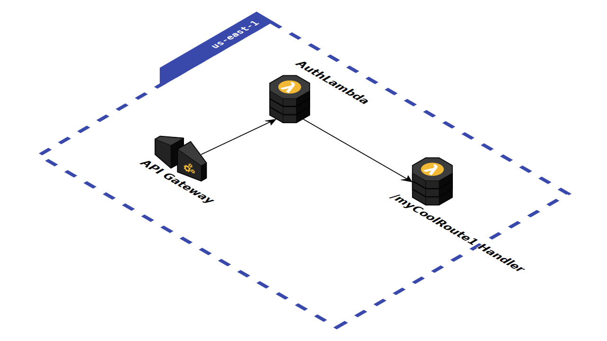

Well, I've had a little time to settle into my new position, and I think I'm starting to hit my stride, so I'll jot down some quick thoughts while they're still fresh. 

# AWS

It's been interesting working with AWS more directly. For the past 3 years of my career, I've been focused almost entirely on app code, not worrying about how things are hosted or updated -- we've had a great DevEx team that provided solutions to handle all the K8s orchestration of the services that I was working on. Now I'm back to having to think about how and where things are set up in AWS. 

## What does a server look like?

When I was at Talent, we had a couple of PHP monolith-type services, a couple of Go services, and a dozen or so lambdas for cron-type jobs. At the time, I remember thinking "huh, that's interesting -- lambdas are super cheap. I wonder if you could build an HTTP server off of them."

As it turns out, you can! Is it a good idea? Maybe.

With a traditional containerized service, you write some code, chuck it into a container, and then (if you're fancy) configure some way to determine at execution time if you need more containers of your service spun up to respond to increased traffic. Similarly, you can kill containers to save money if you're in a lull.

With a lambda, you're only paying for the execution of a given function. So a "route" for an HTTP server could instead look like this:

Compared to EC2 instances, this is very cheap. And it scales without you having to think about it. AND you're only paying for what you use (with caveats). 

## Trouble in Paradise

### But first, an ode to DevEx (Developer Experience)

I spend a lot of time writing code (it's what I get paid to do). From that perspective, great DevEx is a _huge_ force multiplier. If it's easy to build things, it's easy to try new approaches, and iterate on winning business ideas. If it's easy to see what's happening when something goes wrong, devs spend less time fighting fires and debugging, and more time building stuff that might matter.

On the flip side, if it's hard, you're going to have a bad time. Features take forever to build. PMs and other stakeholders become unhappy. Worse, they get scared. Slow delivery makes stakeholders 

This is possible, in the sense that getting hit by lightning twice in a row is possible. 

Being able to iterate locally quickly and deploy changes quickly is one of the best signs of a healthy dev culture that I've encountered. 

In my experience, a fully serverless backend without enough investment in devEx will, over time, suffer devEx degradation until it's miserable to work on the system. I'll break down some of the failure states that I've seen in some upcoming posts.

